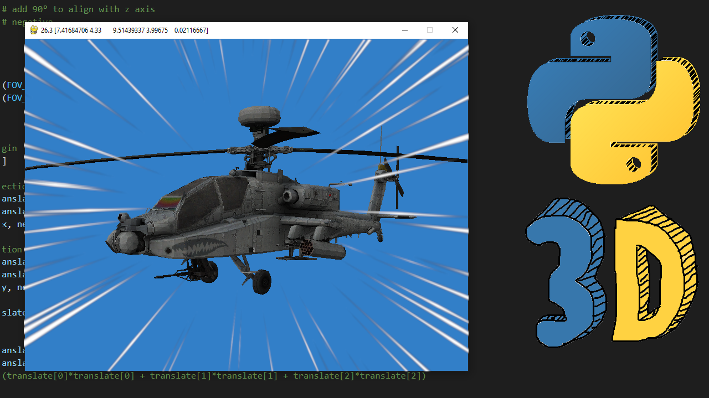

# SimplePython3DEngine

A simple 3D Engine in Python

1 - Projecting points, backface culling and more: https://www.youtube.com/watch?v=D96wb46mjIQ

2 - Drawing triangles with Numba and z-buffer: https://www.youtube.com/watch?v=jg6SXm-dJsg

3 - Drawing triangles with perspective and new projection: coming soon...
